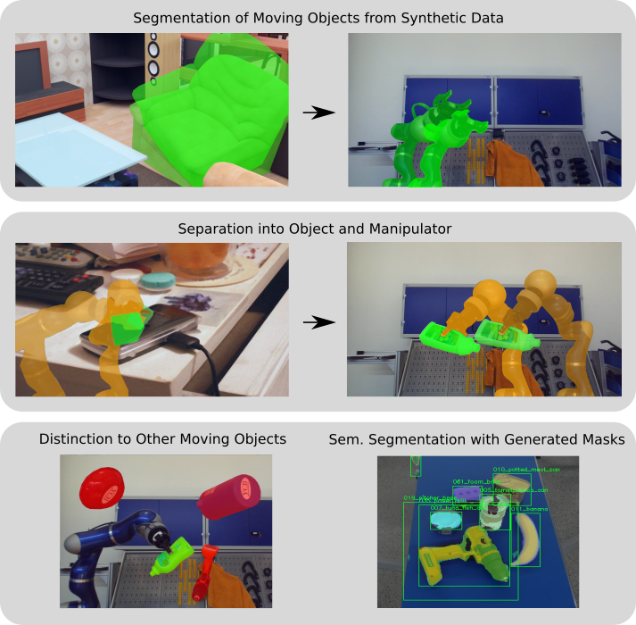

# "What's This?" - Learning to Segment Unknown Objects from Manipulation Sequences

Wout Boerdijk, Martin Sundermeyer, Maximilian Durner and Rudolph Triebel

Accepted at ICRA 2021. [Paper](https://arxiv.org/abs/2011.03279)

### Citation

If you find our work useful for your research, please consider citing

```
@inproceedings{boerdijk2020learning,
  title={" What's This?" - Learning to Segment Unknown Objects from Manipulation Sequences},
  author={Boerdijk, Wout and Sundermeyer, Martin and Durner, Maximilian and Triebel, Rudolph},
  booktitle={ICRA},
  year={2021}
}
```

### Overview

<p align="center">

<p>


### Abstract

We present a novel framework for self-supervised grasped object segmentation 
with a robotic manipulator. Our method successively learns an agnostic foreground segmentation
followed by a distinction between manipulator and object solely by
observing the motion between consecutive RGB frames.
In contrast to previous approaches, we propose a single, end-to-end
trainable architecture which jointly incorporates motion cues and
semantic knowledge. Furthermore, while the motion of the manipulator and the object are
substantial cues for our algorithm, we present means to robustly deal
with distraction objects moving in the background, as well as with
completely static scenes. Our method
neither depends on any visual registration of a kinematic robot or 3D object models, nor on precise
hand-eye calibration or any additional sensor data.
By extensive experimental evaluation we demonstrate the superiority of
our framework and provide detailed insights on its capability of
dealing with the aforementioned extreme cases of motion. 
We also show that training a semantic segmentation network with the automatically labeled data achieves results on par with manually annotated training data.
Code and pretrained model are available at [https://github.com/DLR-RM/DistinctNet](https://github.com/DLR-RM/DistinctNet).

## Prerequisites

This repository contains files to learn segmentation of moving objects as well as distinguishing moving foreground into manipulator and object.
It also contains scripts to generate the respective data.
It is recommended to install all required packages using conda:

```
conda env create -f environment.yaml
```

**Note:** BlenderProc builds its own python environment, so don't run the data generations with BlenderProc with the activated _distinctnet_ environment!

We use [yacs](https://github.com/rbgirshick/yacs) configs, and every training script can be run with `python train_{motion, motion_recurrent, semantic, semantic_recurrent}.py --config-file path/to/config.yaml [OPTIONAL_ARGS]`.
Please refer to yacs's documentation for further details.

## Pretrained model & Demo

You can download a pretrained model trained to segment agnostic moving foreground [here](https://drive.google.com/file/d/1tWoSG8wyHqZ2kZQNgyb9KaOTioW5kc9w/view?usp=sharing).

We provide a [demo script](demo.py) which works with a webcam. After downloading the pretrained model (or with your own), run this script to segment any moving object (or a network finetuned on hand-object segmentation) in front of a camera.
This also works with models that are trained including distractor objects.

## Training

#### 1. (optional) Learn to segment any moving objects from a static camera

**You can skip this step if you plan on using our pretrained model**

- Generate the synthetic training dataset. See [the respective README](blenderproc/motion_dataset/README.md) for further details.
- Run [the training script](train_motion.py): `python train_motion.py --config-file configs/motion.yaml`. 
Make sure you've set the experiment and data paths in the config before, or overwrite it (e.g. `python ... EXP.ROOT /path/to/experiment_root DATA.ROOT /path/to/data_root`).

#### 2. Collect annotated images of a moving manipulator

- We provide a [recording script](record.py) which you can use as a starting point.
- Then, start prediction on the images. See the [prediction script](predict.py) as a starting point. 
Otherwise have a look at the [default predictor](predictor.py).

#### 3. Self-supervised training data generation

- Generate occluding objects. See [the respective README](blenderproc/occluding_objects/README.md) for further details.
- Generate training data by pasting manipulator plus distractor object on random backgrounds. 
We also provide a [script](gen/generate_training_data.py) for this.

#### 4. Fine-tune on semantically distinguishing moving manipulator from grasped object

- Run [the training script](train_semantic.py): `python train_semantic.py --config-file configs/semantic.yaml [OPTIONAL_ARGS]`.

#### 5. Extreme cases of motion

##### a. Distractor objects

You can train step 4 with including distinction to distractor objects.
Make sure that in step 3 you called the data generation script with `--num-distractor-objects [INT]` with an integer larger than 0 (e.g. 5).
Then, adapt the following in the semantic config:
```yaml
DATA.WITH_DISTRACTOR_OBJECTS: True  # don't discard the distractor objects during loading
MODEL.OUT_CH: 5  # add another channel to the output layer
```
This also works for the recurrent semantic config (see also 5.b).
Then proceed by running the training script (Step 4).

##### b. Static scenes

Both motion and semantic models can be trained on static scenes. 
For this, run `python train_{motion, semantic}_recurrent.py --config-file configs/{motion,semantic}_recurrent.yaml [OPTIONAL_ARGS]`.
Note that as in the paper we only fine-tune on the last few layers, meaning the other layers require pretrained weights.
Add a path to the respective state dict in the config, or overwrite the argument (e.g. `python ... MODEL.WEIGHTS /path/to/state_dict.pth`).
For training on static object-manipulator scenes, make sure that during data generation (step 3) you generated multiple images per background by setting `--sequence-length [INT]` with an integer larger than 2 (e.g. 5).
